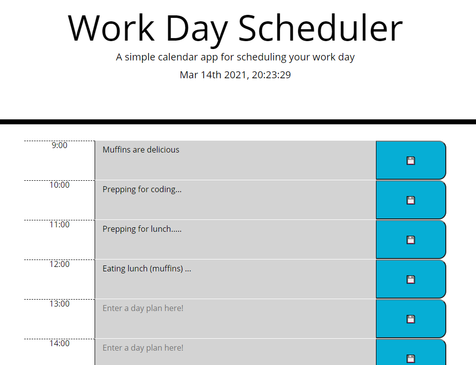

# u05-work-day-scheduler
Simple Calender app for HW5 of FullStack Flex Bootcamp

## Description
This WorkDay Planner allows you to enter a hourly schedule for each hour of the 09:00 to 17:00 work day.

When you click the save button, whatever is in the textarea is saved to local storage, and retrieved on refresh.

The current time of day changes the background color of the textarea to show if it is past, present, or future.

### Links

[Deployed Application](https://epowelldev.github.io/u05-work-day-scheduler/)

[GitHub Repo](https://github.com/epowelldev/u05-work-day-scheduler)